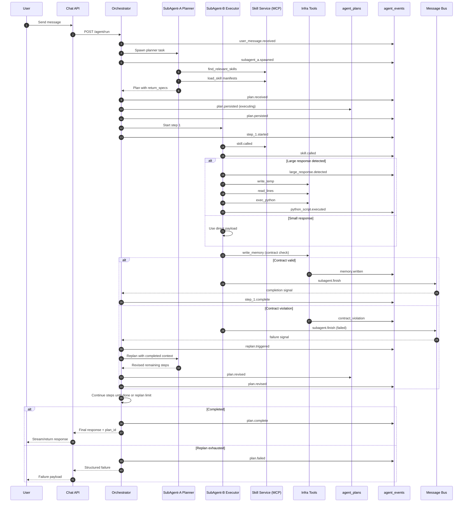

# 10 — Agentic Flow and Integration Flow (Mermaid)

This file contains Mermaid diagrams for:
- Complete agentic execution flow (Manager–Planner–Executor–Infrastructure)
- Complete integration flow across Chat API, Agent Core, Storage, OpenSearch, Skill Service, and Message Bus

## 1) Complete Agentic Execution Flow

```mermaid
flowchart TD
    U[User Message] --> CAPI[Chat API\nPOST /agent/run]
    CAPI --> O1[Orchestrator / Manager\nAgentCore]

    O1 --> S1[Load Soul\nagent_souls]
    O1 --> P0[Create Plan Record\nstatus: pending]
    O1 --> A[SubAgent-A Planner]

    A --> SK1[find_relevant_skills\nvia MCP]
    A --> SK2[load_skill manifests\n2-6 candidates]
    A --> V1[Verify return_spec\nagainst skill schemas]
    A --> PR[Return progressive plan\nmax 10 steps]

    PR --> O2[Persist plan\nstatus: executing]
    O2 --> L1{Next step exists?}

    L1 -->|Yes| B[SubAgent-B Executor\n(single step only)]
    B --> MCP[Call allowed_skills only\nvia MCP]
    MCP --> G{Response size >= threshold?}

    G -->|No| CTX[Use response in context]
    G -->|Yes| WT[write_temp]
    WT --> RL[read_lines sample]
    RL --> PY[Generate extraction script]
    PY --> EX[exec_python sandbox]
    EX --> CTX

    CTX --> SV[Self-validate output\nvs return_spec]
    SV --> WM[write_memory\ncontract + lock + namespace]
    WM --> EV1[Emit subagent.finish\nand memory.upsert]
    EV1 --> O3[Orchestrator updates step status]
    O3 --> L1

    L1 -->|No| FIN[Final synthesis from memory]
    FIN --> RESP[Return response + plan_id]
    RESP --> CAPI

    B --> INS{status: insufficient / failed / contract_violation?}
    INS -->|Yes| RP{replan_count < 3?}
    RP -->|Yes| RA[Replan with SubAgent-A\ncompleted steps preserved]
    RA --> RM[Merge revised remaining steps]
    RM --> O2
    RP -->|No| FAIL[Structured failure\nmax replans reached]
    FAIL --> CAPI
```

## 2) Complete Integration and Boundary Flow

```mermaid
flowchart LR
    subgraph ZA[Zone A - Chat API]
        CHAT[Session/Auth/Streaming]
    end

    subgraph ZB[Zone B - Agentic Service]
        API[FastAPI Endpoints\n/agent/run, /agent/plans, /trace]
        CORE[AgentCore Orchestrator]
        PM[Planner + Executor Runtime\n(ADK-aligned)]
        TOOLS[Infra Tool Suite\nwrite/read memory,temp,python]
    end

    subgraph ZC[Zone C - Storage Adapter]
        SA[Schema Validation Layer\nJSON Schema + typed errors]
    end

    subgraph ZD[Zone D - OpenSearch]
        OS1[(agent_memory)]
        OS2[(agent_plans)]
        OS3[(agent_events)]
        OS4[(agent_sessions)]
        OS5[(agent_souls)]
    end

    subgraph ZE[Zone E - Skill Service]
        SS[Skill Service\nMCP/HTTP\nscoped by cloud_skill_service]
    end

    subgraph ZF[Zone F - Message Bus]
        MB[(Redis Streams)]
    end

    CHAT -->|X-Tenant-Id\nX-User-Id\nX-Session-Id| API
    API --> CORE
    CORE --> PM
    PM --> TOOLS

    CORE --> SA
    TOOLS --> SA
    SA --> OS1
    SA --> OS2
    SA --> OS3
    SA --> OS4
    SA --> OS5

    PM -->|discover/load/execute skills| SS
    SS -->|skill response| PM

    CORE -->|subagent lifecycle\nstep signals\ncancel tokens| MB
    PM -->|subagent.finish\nstatus events| MB
    TOOLS -->|memory.upsert| MB

    MB --> CORE
    CORE --> API
    API --> CHAT
```

## Notes

- Chat API never spawns subagents directly.
- AgentCore never bypasses Storage Adapter for persistence.
- SubAgent-B never executes skills outside step `allowed_skills`.
- Replanning preserves completed steps and revises only remaining steps.

## 3) Monitoring Trace Sequence (Event-by-Event)


